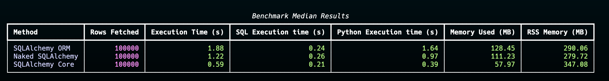

# Why Naked SQLAlchemy?

TLDR; Naked SQLAlchemy is a thin layer on top of SQLAlchemy Core that makes it easier to work with databases in Python. It simplifies the process of executing queries and mapping results to data classes, without the complexity of an ORM. It's faster, more efficient, and easier to understand and eaiser to maintain than traditional ORMs.

Naked SQLAlchemy also offers some extra features that are not available in SQLAlchemy Core, and planning to add more features in the future, current features are:

1. **Dataclass Mapping**: Automatically map query results to data classes.
2. **Stateless Session Management**: Manage database connections and transactions.
3. **Database Views**: Define views just like tables!

## SQLAlchemy

SQLAlchemy is a Python library for working with databases. It has two main components:

1. Core
2. ORM

### Core

A SQL toolkit that allows you to write database queries using Python code. It provides a way to construct SQL expressions and execute them without writing raw SQL.

Here are some highlights of the Core:

- **DML (Data Manipulation Language) Statements**:

  - **Insert**: Add new records to tables.
  - **Update**: Modify existing records.
  - **Delete**: Remove records from tables.
  - **Select**: Retrieve data from tables.

- **SQL Expression Language**:

  - Define tables and columns using Python classes.
  - Build complex SQL queries using Python expressions.

- **Connection Pooling**:

  - Efficiently manage database connections.
  - Support for transactions and concurrency.

- **Databse Connection**:

  - Connect to a wide variety of databases (SQLite, MySQL, PostgreSQL, etc.).
  - Use a consistent API regardless of the database backend.
  - Support for database-specific features.

### ORM

The Object-Relational Mapper (ORM) is a layer on top of the Core that lets you map database tables to Python classes. This means you can work with your data as Python objects rather than dealing directly with SQL queries.

Features of the ORM include:

- **Object Mapping**:

  - Use Python classes to define database models.

- **Relationship Management**:

  - Define relationships between models (one-to-many, many-to-many).
  - Automatically handle joins and foreign keys.

- **Session Management**:

  - Interact with the database through a session.
  - Manage transactions and track changes to objects.

- **Dirty Tracking**:

  - Detect changes to objects and update the database accordingly.
    - So updating a python ORM object in memory will automatically update the database when the session is committed.
    - Keeping the database in sync with the python objects.

## ORMs are conceptually wrong ...

As you have read, there are many features in SQLAlchemy ORM/today's ORM. They are no longer just a simple object mapper, but a full-fledged data manipulation tool, which is conceptually wrong. but why?

There are many pitfall in ORMs, they are hard to learn, very complex, and they are not even close to being efficient and fast!

Read about some of the pitfalls of ORMs:

??? danger "The pitfall of Dirty Tracking"

    Imagine this scenario:
        1. Query user id 1 from the database.
        2. Mutate the user first name from "John" to "Jane".
        3. Query user id 1 again from the database.
        4. Mutate the last name from "Doe" to "Smith".
        5. Commit the transaction.

    What do you think happens?
    Well, SQLAlchemy ORM will update both first name and last name as expected, which looks great at first glance.
    But think about how it would do that?

     1. When you query a row first time, SQLAlchemy construct an identitiy key for that row. Identity key is a unique key that identifies a row in the database. By design, it always pick "primary key" as the identity key, which makes sense.
     Then keep the object in the memory, and track all the changes you make to that object, and mapped it to the identity key.

     2. Then next time you query the same table from database again, it calculate identity key, and check if the object is already in the memory. Given our scenario, the object exists in memory. So it makes a diff between the object in memory and the object from the database, and apply the diff to the object in memory. After that, it always only keep one version of the object in memory and disregard the other version of the object that came from database.

    Check this example:

    ```  python
    obj1 = sa.select(User).where(User.id == 1).scalar().one()
    obj1.first_name = "Jane"

    obj2 = sa.select(User).where(User.id == 1).scalar().one()
    obj2.last_name = "Smith"

    obj2.first_name # Jane
    ```

    why obj2 first name is "Jane"? Because the object in memory is the same object that came from the first query. So the changes you made to the object in memory is still there. This is the dirty tracking feature of SQLAlchemy ORM. It's implictly mutating other objects in memory, so in fact obj1 and obj2 are the same object, and have same memory address.

    Why is this bad idea in my opinion?

    1. Explicit is better than implicit. It's hard to understand what's going on in the background.

    2. What if you can't uniquly identify a row from database? The assumption to always fallback on primary key and table always have primary key is wrong, a view does not have a primary key, and a table might not have a primary key as well. So what if you can't uniquely identify a row from database? Well, you can't use ORM in that case. That is why View could be easily supported in Naked SQLAlchemy, but not in SQLAlchemy ORM.

    3. What if something goes wrong in this process? Good luck with that! It's a nightmare to debug such issues.
        I already faced such issues. The side effect is that if algorithm fail to understand the diff, the object you had in memory
        is not same as the object returned by database. I had a case where I was updating a row, setting a value to 2, and fetching the row from database again, when I got the row back, the value was still 1 on my memory! but of course this only happens with SQLAlchemy ORM, not with Core. because Core doesn't have such feature and simply create a python object for each row fetched from database.


    This is the code snippet that caused this issue:

    ``` python
    # --------------------------------------
    # it seems SQLAlchemy tries to figure out what changes happened to database, and try to apply it to the tracked objects from Sessoin
    # if update query is too complicated, it just fail
    # then worst thing happens, it shadow a completely different object as result of database
    # but if you run the query with connection(CORE), it works and return corrected result.
    # --------------------------------------

    from contextlib import asynccontextmanager
    from dataclasses import asdict
    from datetime import UTC, datetime, timedelta
    from uuid import uuid4

    import pytest
    import sqlalchemy as sa
    from sqlalchemy.ext.asyncio import AsyncSession as SmartAsyncSession
    from sqlalchemy.ext.asyncio import async_sessionmaker, create_async_engine
    from sqlalchemy.orm import DeclarativeBase, Mapped, MappedAsDataclass, mapped_column

    from naked_sqla.om.asession import AsyncSession, AsyncSessionFactory

    class BaseSQL(MappedAsDataclass, DeclarativeBase): ...

    class Event(BaseSQL):
    **tablename** = "Events"
    event: Mapped[str] = mapped_column(sa.String())
    created_at: Mapped[datetime] = mapped_column(sa.DateTime(timezone=True))
    id: Mapped[str] = mapped_column(
    primary_key=True, default_factory=lambda: str(uuid4())
    )
    author_id: Mapped[str] = mapped_column(
    primary_key=True, default_factory=lambda: str(uuid4())
    )

    @asynccontextmanager
    async def init_naked_db():
    engine = create_async_engine("sqlite+aiosqlite:///:memory:", echo=False)
    db = AsyncSessionFactory(engine)
    async with engine.begin() as conn:
    await conn.run_sync(BaseSQL.metadata.create_all)
    yield db

    @asynccontextmanager
    async def init_sqlachemy_db():
    engine = create_async_engine("sqlite+aiosqlite:///:memory:", echo=False)
    db = async_sessionmaker(engine, expire_on_commit=False, autobegin=False)
    async with engine.begin() as conn:
    await conn.run_sync(BaseSQL.metadata.create_all)
    yield db

    async def complicated_update_scenario(session: AsyncSession | SmartAsyncSession):
    """
    A scenario where we need to update a row based on the next row's value.
    The updated row is the one that has the event value of "2".
    """
    now = datetime.now(UTC)
    author_id = str(uuid4())
    objs = [
    Event(author_id=author_id, event="1", created_at=now - timedelta(days=4)),
    Event(author_id=author_id, event="2", created_at=now - timedelta(days=3)),
    ]

        inserted_objs = (
            await session.execute(
                sa.insert(Event).returning(Event), [asdict(obj) for obj in objs]
            )
        ).all()
        print(inserted_objs)

        event_lead = sa.select(
            Event.id,
            sa.func.lead(Event.event)
            .over(
                partition_by=Event.author_id,
                order_by=Event.created_at,
            )
            .label("next_event"),
        ).subquery()
        event_query = (
            sa.select(event_lead.c.id)
            .select_from(event_lead)
            .where(event_lead.c.next_event == "2")
        )

        query = (
            sa.update(Event)
            .where(Event.id.in_(event_query))
            .values(event="2")
            .returning(Event)
        )

        result = (await session.execute(query)).scalars().first()
        assert result is not None
        return result

    @pytest.mark.asyncio
    async def test_complicated_update_map_correctly_in_naked_sqla():
    async with init_naked_db() as db:
    async with db.begin() as session:
    result = await complicated_update_scenario(session)
    assert result.event == "2"

    @pytest.mark.asyncio
    async def test_complicated_update_map_incorrectly_in_sqlalchemy():
    async with init_sqlachemy_db() as db:
    async with db.begin() as session:
    result = await complicated_update_scenario(session)
    assert result.event == "1"
    ```

??? warning "The pitfall of Relationship Management"

    The pitfall of relationship management is N+1 query problem. It's a common problem in ORMs, where you fetch a row from a table, and then fetch related rows from another table, and then fetch related rows from another table, and so on. This results in a large number of queries being executed, which can be slow and inefficient.

??? warning " The pitfall of Session Management"

    The pitfall of session is that if your transaction is rollbacked, the session will automatically expire your object.
    That means, althought you have the object typed in your code, but if you try to access the attribute, it fails.
    This of course make sense if you think about it, because the object is not in the database anymore, so it should not be in the memory as well. But it's a pitfall if you are not aware of it. Session is a very stateful and comlpex object in SQLAlchemy.

And to be honest, I don't understand the win. What benfit would ORM have for you?

1. Not writing an explicit join so it figures out by itself implicitly?
2. Reusing a old out-of-date object in memory instead of fetching the new one from database?
3. Not updating the database when you update the object in memory?

Compare these wins, to negative sides of ORM; what if we use SQL very explicitly, and write the joins explicitly, and fetch the new object from database every time we need it, and update the database explicitly? Well, that's basically using Core!

1. **Universal Understanding**: SQL is a well-established language that most developers are familiar with. By using SQL directly, you tap into a common knowledge base, making it easier for team members to read and understand the code.

2. **Shallow Learning Curve**: Learning an ORM often requires understanding a new set of abstractions and query syntax. Sticking with SQL or SQLAlchemy Core minimizes the learning curve, allowing developers to be productive quickly.

3. **Code Readability**: SQL queries written using SQLAlchemy Core are more transparent and closer to actual SQL. This makes the code easier to read and maintain, as opposed to deciphering ORM-specific methods and functions.

4. **Avoiding Over-Abstraction**: SQL is already an abstraction over the way data is stored and retrieved. Introducing an ORM adds another layer of abstraction, which can sometimes obscure what's happening under the hood and lead to less efficient code.

but there's one small issue with using Core, it does not map the result of query to a dataclass. So imagine you write a query such as `sa.select(User)`, what happens is that it return you a tuple of rows, where each row is a tuple of columns. So you need to manually map the result to a dataclass.

And that's what this library is for! Naked SQLAlchemy provides a thin layer on top of SQLAlchemy Core to make it easier to work with databases in Python. It simplifies the process of executing queries and mapping results to data classes. By bypassing sessions, increasing speed, avoiding incorrect results, and eliminating implicit behaviors, it addresses the exact limitations that often cause issues in traditional ORMs. The new "ORM" or object mapper I wrote is only 500 lines of code in its first working version, which is about 30 times less than SQLAlchemy's codebase, and it's significantly faster and more efficient because it does only what it should do, and nothing more. It's not just about speed; traditional ORMs have many pitfalls due to their implicit behaviors, making them harder to understand and more likely to cause bugs. This library bridges over these issues and provides a more straightforward, explicit way to interact with your database.

As you can see, Naked SQLALchemy is almost 2 times faster than ORM, Althought as expected, core is still way faster because it does less!


> The key to making programs fast is to make them do practically nothing.
>
> -- <cite>Mike Haertel, Author of GNU grep</cite>
